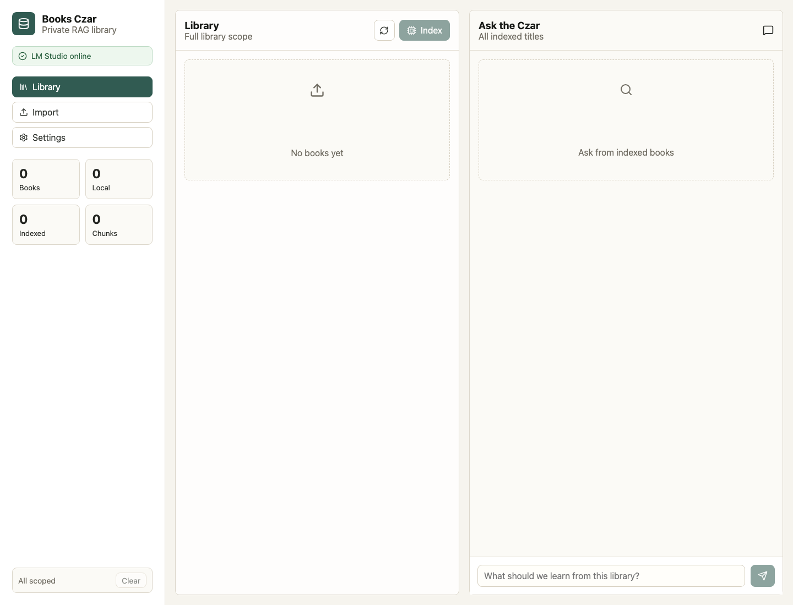
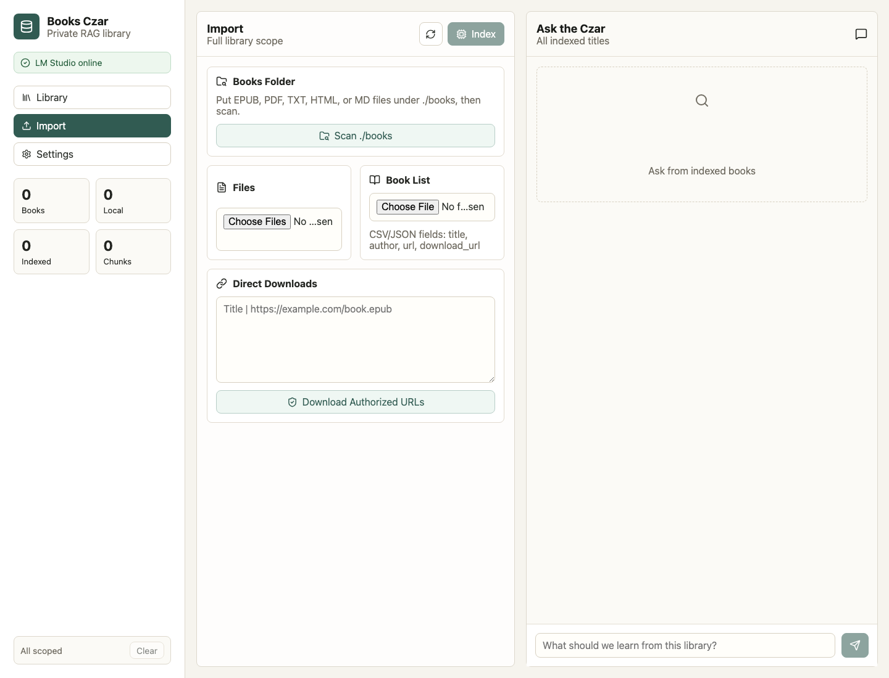
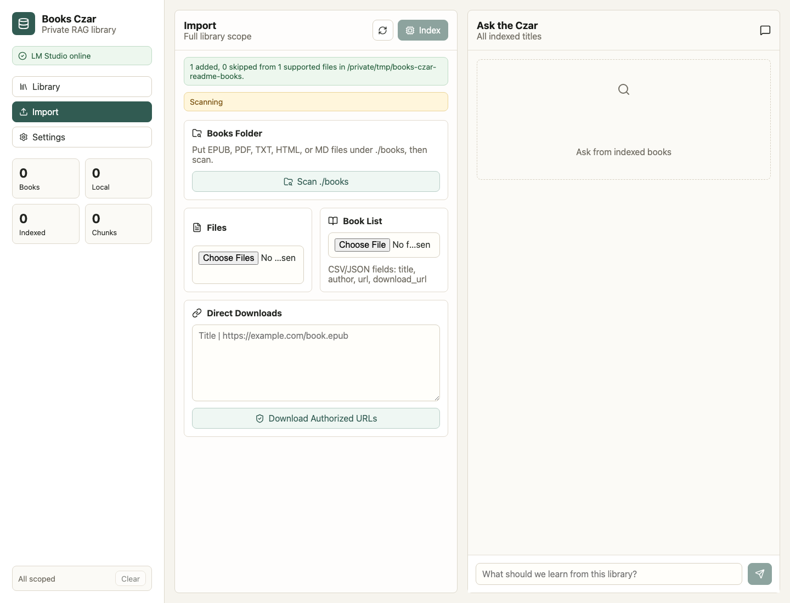
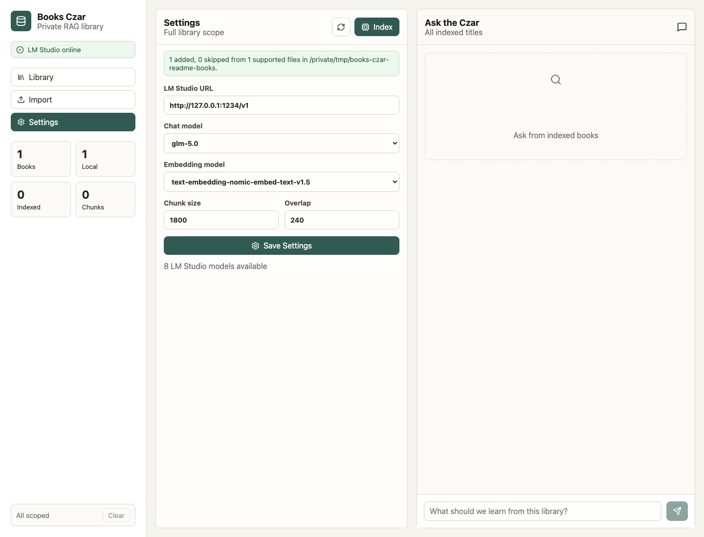
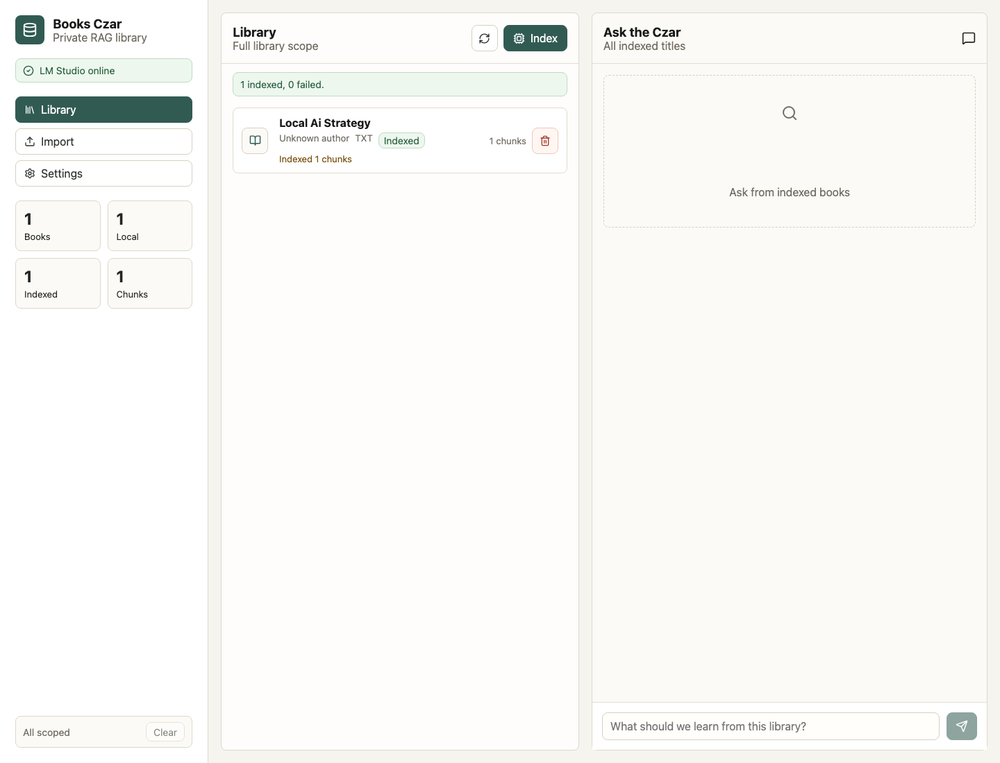
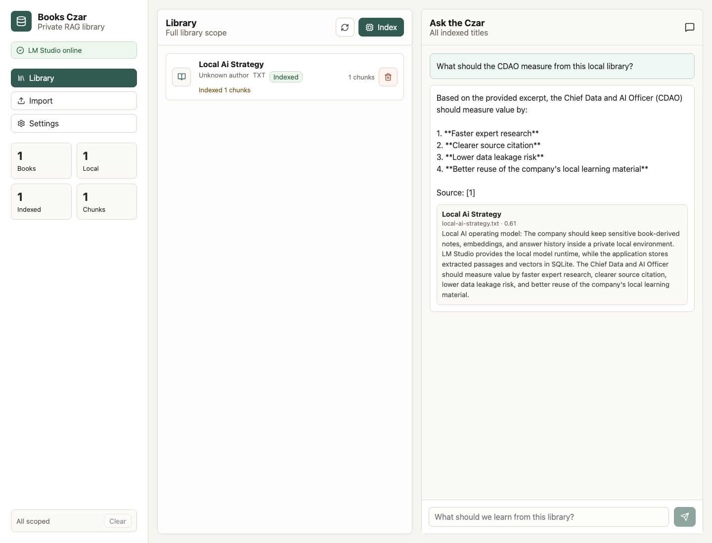
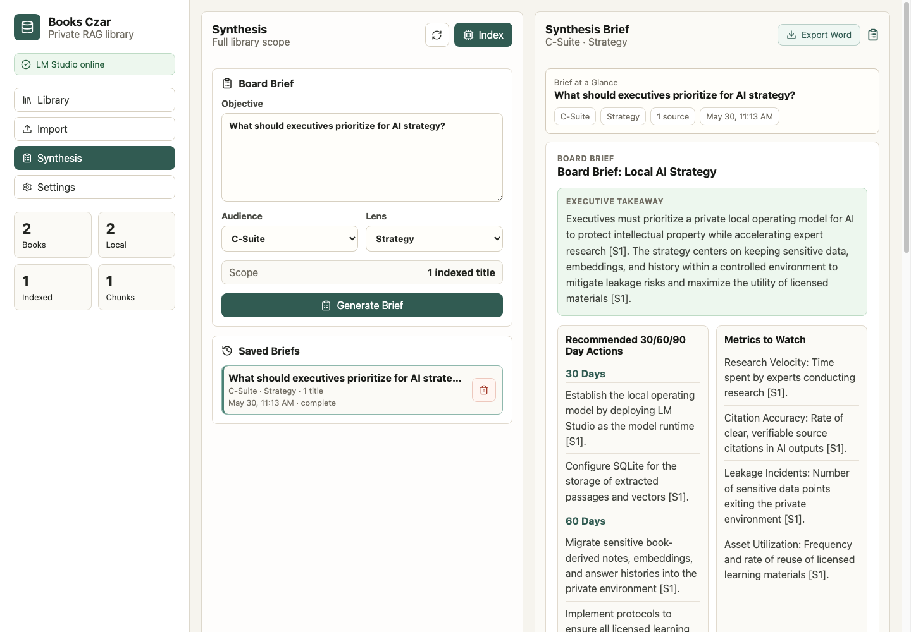
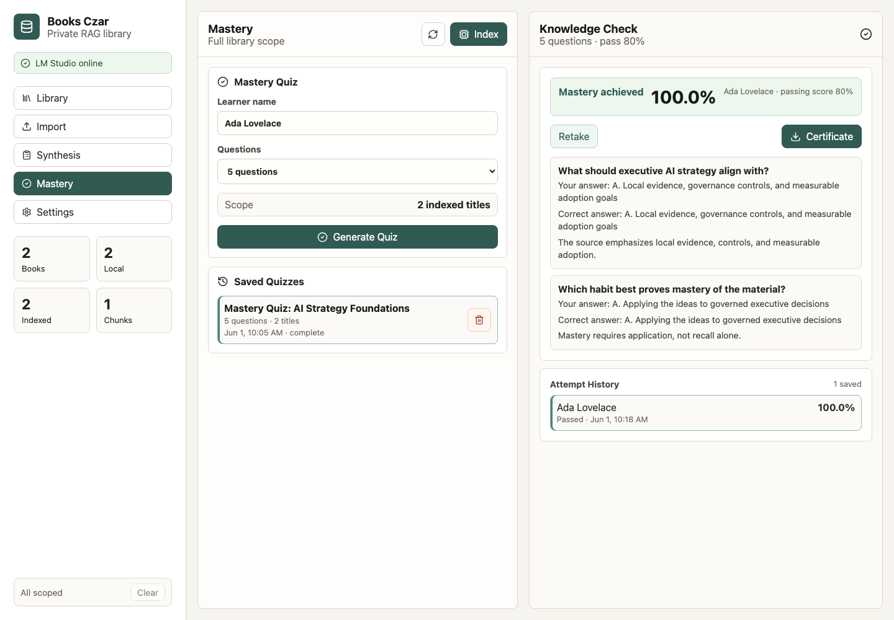

# Books Czar

Books Czar is a private RAG workbench for an executive technical library.
It imports local books, indexes them with an LM Studio embedding model, and
answers questions through an LM Studio chat model with cited local passages.

Supported paths:

- Upload authorized local `.epub`, `.pdf`, `.txt`, `.md`, or `.html` files.
- Put authorized local `.epub`, `.pdf`, `.txt`, `.md`, or `.html` files under
  `./books` and scan the folder from the app.
- Import a book list as CSV/JSON so titles can be tracked locally.
- Download direct `.epub`, `.pdf`, `.txt`, `.md`, or `.html` URLs only when those
  URLs are already authorized for local download.

## Requirements

- Python 3.11+
- Node.js 20+
- LM Studio with the local server enabled
- A loaded chat model and embedding model in LM Studio

Default LM Studio API settings:

- Base URL: `http://127.0.0.1:1234/v1`
- Chat model: `local-model` auto-selects the first non-embedding model LM Studio exposes
- Embeddings: `text-embedding-nomic-embed-text-v1.5`

You can also choose models from the app. Open Settings after LM Studio is
running; Books Czar loads available model IDs from LM Studio and shows dropdowns
for both the chat model and embedding model.

## Run With Docker Compose

The fastest local setup is Docker Compose. Start LM Studio first, then run:

```bash
docker compose up --build
```

If your Docker installation uses the legacy command, this works too:

```bash
docker-compose up --build
```

Open `http://127.0.0.1:5173`. The API is available at
`http://127.0.0.1:8000`.

Docker Compose mounts your local `./books` folder into the backend container and
stores SQLite metadata, chunks, and embeddings in the `books_czar_data` Docker
volume. Put authorized `.epub`, `.pdf`, `.txt`, `.md`, or `.html` files in
`./books`, then open Import and scan the folder from the app.

When Books Czar runs in Docker, `127.0.0.1` inside the backend container is the
container itself. The Compose setup points to LM Studio on the host machine with
`http://host.docker.internal:1234/v1` by default. Override it when needed:

```bash
LMSTUDIO_BASE_URL=http://host.docker.internal:1234/v1 docker compose up --build
```

Stop the app:

```bash
docker compose down
```

Reset the Docker-managed index and metadata:

```bash
docker compose down -v
```

## Run Without Docker

```bash
python3 -m venv .venv
./.venv/bin/python -m pip install -r requirements.txt
./.venv/bin/uvicorn backend.main:app --reload --host 127.0.0.1 --port 8000
```

In another terminal:

```bash
cd frontend
npm install
npm run dev
```

Open `http://127.0.0.1:5173`.

## Getting Started

1. Start LM Studio and load a chat model plus an embedding model.
2. Put your local `.epub`, `.pdf`, `.txt`, `.md`, or `.html` files under `./books`.
3. Start the app with Docker Compose or start the backend and frontend manually,
   then open `http://127.0.0.1:5173`.
4. Confirm the status pill says `LM Studio online`.



Open Import and scan the local `./books` folder. You can also upload files,
import a CSV/JSON book list, or download direct authorized file URLs.



After scanning, Books Czar registers supported files in the local library.



Open Settings to choose the LM Studio models. The chat model is used to answer
questions; the embedding model is used for indexing and retrieval.



Click `Index` to chunk the local books, create embeddings, and store the vectors
in SQLite.



Ask the Czar a question. Books Czar retrieves the most relevant local passages,
sends those excerpts to the chat model, and shows cited source context.



## Executive Synthesis

Open Synthesis to generate a saved Board Brief across indexed books. The guided
workflow asks for an objective, audience, and lens, then retrieves evidence
across the selected indexed titles. If no books are selected, Books Czar uses all
indexed titles.

Synthesis briefs use the same local LM Studio chat and embedding settings as Ask
the Czar. Generated briefs are saved locally in SQLite with their source
excerpts, so you can reopen prior executive summaries. From the brief header,
use `Export Word` to download a Microsoft Word `.docx` version for review,
circulation, or board-prep notes.



## Mastery Quizzes

Open Mastery to generate a saved multiple-choice knowledge check from indexed
books. The quiz uses selected indexed books as its scope; if nothing is
selected, Books Czar uses all indexed titles. Each question has one correct
answer, three plausible distractors, and citations back to retrieved book
evidence.

Enter a learner name before submitting. Attempts are scored locally, and a score
of `80%` or higher unlocks a downloadable PDF certificate of completion.



## Local Books Folder

By default, Books Czar scans `./books` recursively. You can change that with
`BOOKWISE_BOOKS_DIR`.

```text
books/
  ai-strategy.epub
  data-platforms/
    architecture.pdf
  notes.md
```

In the app, open Import and click `Scan ./books`, then click `Index`.

## Manifest Formats

CSV:

```csv
title,author,url,download_url
Designing Data-Intensive Applications,Martin Kleppmann,https://example.com/catalog/designing-data-intensive-applications,
```

JSON:

```json
{
  "books": [
    {
      "title": "Example Book",
      "author": "Example Author",
      "url": "https://example.com/catalog/example",
      "download_url": "https://example.com/example.epub"
    }
  ]
}
```

## API

- `GET /api/models` lists available LM Studio model IDs for the Settings dropdowns.
- `POST /api/books/upload` uploads local files.
- `POST /api/books/manifest` queues a CSV/JSON title list.
- `POST /api/books/download` downloads authorized direct file URLs.
- `POST /api/index` embeds stored books into SQLite.
- `POST /api/chat` performs retrieval and asks LM Studio for an answer.
- `POST /api/syntheses` generates and saves a multi-book executive synthesis.
- `GET /api/syntheses` lists saved synthesis runs.
- `GET /api/syntheses/{id}` returns one saved synthesis run.
- `GET /api/syntheses/{id}/word` exports a saved synthesis run as a Word `.docx`.
- `DELETE /api/syntheses/{id}` removes one saved synthesis run.
- `POST /api/quizzes` generates and saves a mastery quiz.
- `GET /api/quizzes` lists saved mastery quizzes.
- `GET /api/quizzes/{id}` returns quiz questions without answer keys.
- `POST /api/quizzes/{id}/attempts` scores and saves a quiz attempt.
- `GET /api/quizzes/{id}/attempts` lists saved attempts for a quiz.
- `GET /api/quiz-attempts/{id}/certificate` exports a passed attempt as a PDF.
- `DELETE /api/quizzes/{id}` removes one quiz and its attempts.

## Data

Local files, SQLite metadata, chunks, and embeddings live under `./data` by default.
Set `BOOKWISE_DATA_DIR` to move the library.

With Docker Compose, the local `./books` folder is mounted at `/app/books` and
application data is stored in the `books_czar_data` Docker volume.

## RAG Pattern

This application uses Retrieval-Augmented Generation:

1. Ingest local books from upload, manifest, direct download, or `./books`.
2. Parse text from EPUB/PDF/TXT/HTML/MD files.
3. Chunk the text and create embeddings through LM Studio.
4. Store chunks and embeddings in SQLite.
5. Embed the user question, retrieve the most similar chunks, and send only
   those excerpts as context to the local chat model.
6. Return the model answer with source excerpts and similarity scores.

The Synthesis workflow uses the same indexed chunks but runs several retrieval
questions across the selected books, deduplicates repeated passages, and asks the
local chat model for a structured, citation-backed Board Brief.

The Mastery workflow uses the same indexed chunks to retrieve evidence for quiz
generation, asks the local chat model for strict four-choice JSON questions, and
keeps the correct answer key server-side until an attempt is submitted.

## Tests

Run unit and API tests:

```bash
./.venv/bin/python -m pytest
```

Run behavior-driven end-to-end tests:

```bash
./.venv/bin/behave tests
```

Run frontend brief parser tests:

```bash
cd frontend
npm run test:brief
```

Run the frontend build:

```bash
cd frontend
npm run build
```
